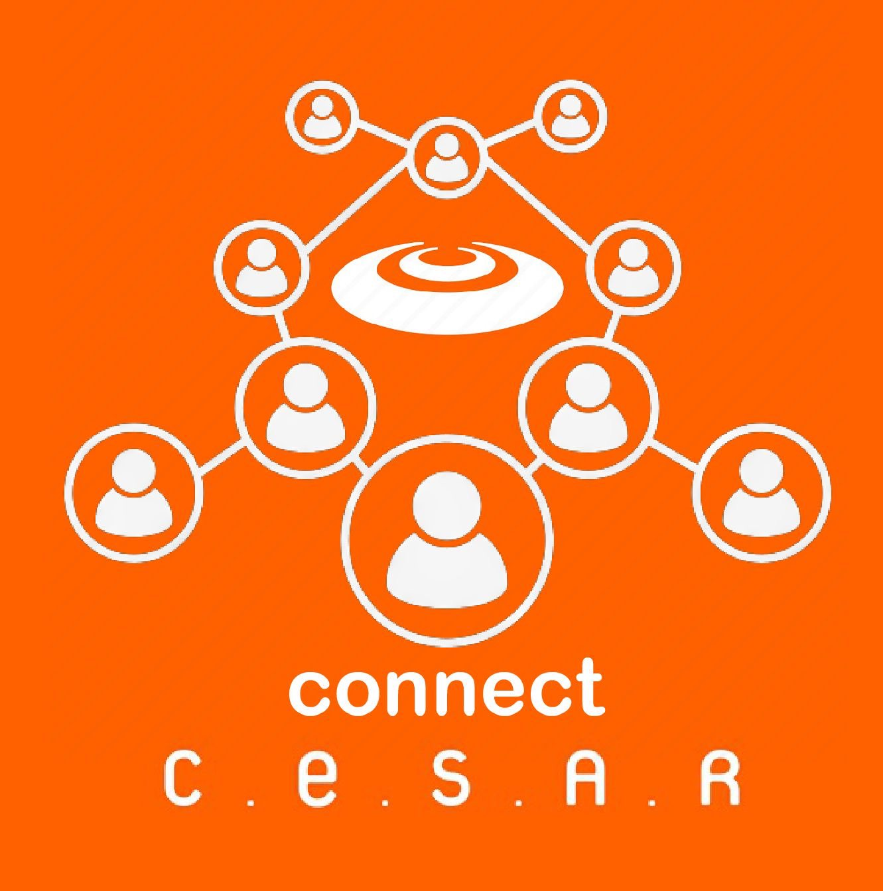

  

<h1 align="center">Connect CESAR</h1>

  

  
  
  
  

  Plataforma criada para a cadeira de Fundamentos de Desenvolvimento de Software
  com o intuito de reunir os estudantes das graduações da CESAR School na
  cadeira de Projetos.
   
  Através do seu uso, os alunos poderão formar grupos mais facilmente,
  visualizando os perfis das pessoas cadastradas com as mais diversas
  informações, como tipo de perfil, características, habilidades, interesses,
  etc.
   
  Dessa forma, com o Connect CESAR, o network entre os estudantes será
  impulsionado, levando os grupos a serem montados de uma maneira rápida,
  prática e eficiente.

<h2>Links Importantes</h2>
<ul>
    <li>
        <a href="https://connectcesar.azurewebsites.net/">Connect CESAR Site</a>
    </li>
  <li>
    <a
      href="https://docs.google.com/document/d/1u0d6eJo4CssFMLD0yrG8uC1CYGwSa5j2c7FekSvYrls/edit"
      >Instruções de Uso</a
    >
  </li>
  <li>
    <a
      href="https://www.figma.com/file/UyXPbIk4jsHQoTUXDffQGl/Connect-CESAR?type=design&node-id=516-91&mode=design"
      >Figma</a
    >
  </li>
  <li>
    <a
      href="https://connectcesar.atlassian.net/jira/software/projects/CC/boards/1/"
      >Jira Software</a
    >
  </li>
</ul>

Entrega 1

<ul>
  <li>
    <a
      href="https://drive.google.com/drive/u/1/folders/17Od0QMrcoO7zWpWf8BNeMCmSD9pZeAAL"
      >Screen Cast</a
    >
  </li>
  <li>
    <a
      href="https://drive.google.com/drive/u/1/folders/17Od0QMrcoO7zWpWf8BNeMCmSD9pZeAAL"
      >Quadro Jira</a
    >
  </li>
  <li>
    <a
      href="https://drive.google.com/drive/u/1/folders/17Od0QMrcoO7zWpWf8BNeMCmSD9pZeAAL"
      >Backlog Jira</a
    >
  </li>
</ul>

Entrega 2

<ul>
  <li>
    <a
      href="https://drive.google.com/drive/u/1/folders/1GFkLI7lYtK0-wmRKKt89O11iePMaiLzi"
      >Screen Cast</a
    >
  </li>
  <li>
    <a
      href="https://drive.google.com/drive/u/1/folders/1GFkLI7lYtK0-wmRKKt89O11iePMaiLzi"
      >Quadro Jira</a
    >
  </li>
  <li>
    <a
      href="https://drive.google.com/drive/u/1/folders/1GFkLI7lYtK0-wmRKKt89O11iePMaiLzi"
      >Backlog Jira</a
    >
  </li>
  <li>
    <a
      href="https://docs.google.com/document/d/1HMgFS6grvc7ghHJqa_3I_6-wmORn5KY4ejPAV3zUSWQ/edit"
      >Programação em Par</a
    >
  </li>
  <li>
    <a
      href="https://drive.google.com/drive/u/1/folders/1GFkLI7lYtK0-wmRKKt89O11iePMaiLzi"
      >Diagrama de Atividades</a
    >
  </li>
  <li>
    <a
      href="https://drive.google.com/drive/u/1/folders/1GFkLI7lYtK0-wmRKKt89O11iePMaiLzi"
      >Issue/Bug Tracker</a
    >
  </li>
</ul>

Entrega 3

<ul>
  <li>
    <a
      href="https://drive.google.com/file/d/1Udsy_FKkBAg6b-qUxlRGdzA6NvPUe9aw/view?usp=sharing"
      >Screen Cast Lo-Fi</a
    >
  </li>
  <li>
    <a
      href="https://docs.google.com/document/d/1HMgFS6grvc7ghHJqa_3I_6-wmORn5KY4ejPAV3zUSWQ/edit"
      >Programação em Par</a
    >
  </li>
  <li>
    <a
      href="https://drive.google.com/file/d/1tWGRZJJHDdicarxU_Uurw_UfHnUOOzM9/view?usp=sharing"
      >Diagrama de Atividades</a
    >
  </li>
  <li>
    <a
      href="https://drive.google.com/file/d/16twTmzdnlCoeb0uQoOahw3BQOWDS-a9E/view?usp=drive_link"
      >Quadro Jira</a
    >
  </li>
  <li>
    <a
      href="https://drive.google.com/file/d/1MH3TS5cuXy24nA9EN04qUSxoe_B1_Z_e/view?usp=drive_link"
      >Backlog Jira</a
    >
  </li>
  <li>
    <a
      href="https://drive.google.com/file/d/156j0OIhOYaN5MwGQdGsmeQW-YFkoDBJS/view?usp=drive_link"
      >Bug Tracker</a
    >
  </li>
  <li>
    <a
      href="https://drive.google.com/file/d/1sUyqQmcSdY-dIE8ImmqgIM0Wdc1_52eq/view?usp=drive_link"
      >ScreenTest Testes Selenium</a
    >
  </li>
  <li>
    <a
      href="https://drive.google.com/file/d/10bffUjA1PbRAjuCwdISLdUVaJBV5JQpw/view?usp=drive_link"
      >CI/CD</a
    >
  </li>
   <li><a href="https://drive.google.com/file/d/1ITPU6Z6pM1-UmH_O-HkLNS4g8C6t3Pq4/view?usp=drive_link">ScreenCast Site</a></li>
</ul>

Entrega 4

<ul>
  <li>
    <a
      href="https://docs.google.com/document/d/1HMgFS6grvc7ghHJqa_3I_6-wmORn5KY4ejPAV3zUSWQ/edit"
      >Programação em Par</a
    >
  </li>
  <li>
    <a
      href="https://github.com/caetrias/connectcesar/blob/main/CONTRIBUTING.md"
      >Contributing.md</a
    >
  </li>
</ul>

  
  
  
  
  
  
  
  
  
  

<h2>Equipe</h2>
<ul>
  <li>
    <a href="https://github.com/ArthurpBrito">Arthur Brito</a> -
    apb@cesar.school 📩
  </li>
  <li>
    <a href="https://github.com/brunoribeirol">Bruno Ribeiro</a> -
    brlla@cesar.school 📩
  </li>
  <li>
    <a href="https://github.com/couboii">Emanuel Eduardo</a> -
    eess2@cesar.school 📩
  </li>
  <li>
    <a href="https://github.com/caetrias">Gabriel Caetano</a> -
    gcgpf@cesar.school 📩
  </li>
  <li>
    <a href="https://github.com/iaa877">Igor Alves</a> - iaa@cesar.school 📩
  </li>
  <li>
    <a href="https://github.com/Jonny-Jay">João Vítor Meneses</a> -
    jvmf@cesar.school 📩
  </li>
  <li>
    <a href="https://github.com/Zabbak">Lucas Kabbaz</a> - lbk@cesar.school 📩
  </li>
</ul>

<h2>Contribuintes 👨‍👩‍👧‍👦</h2>

