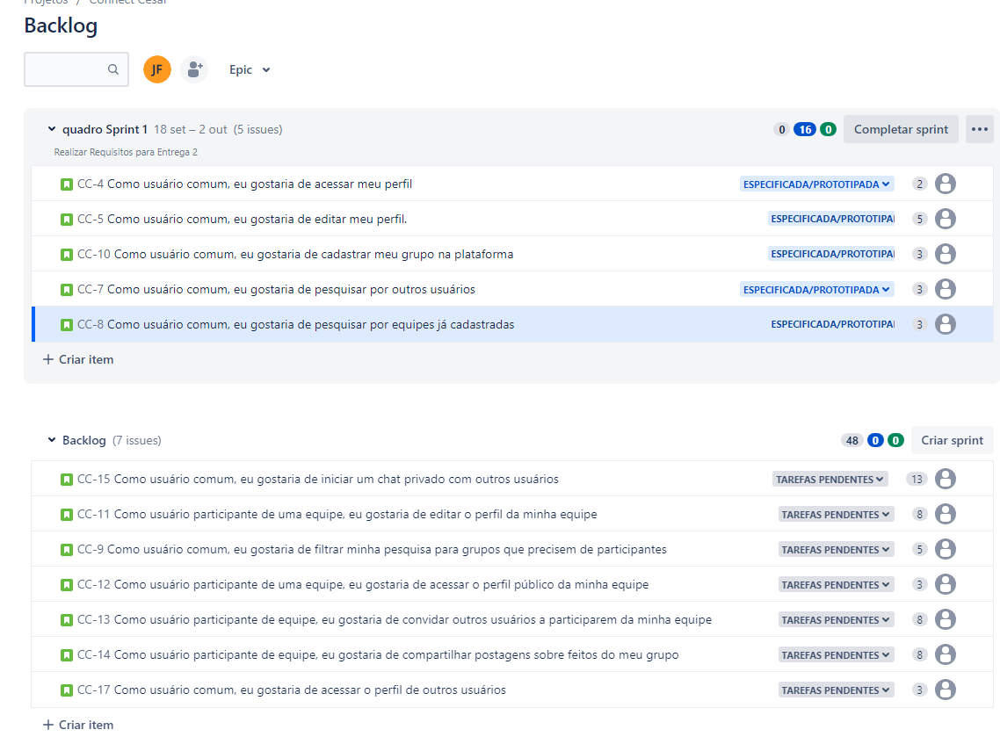
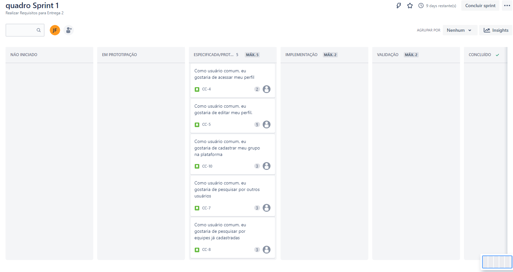
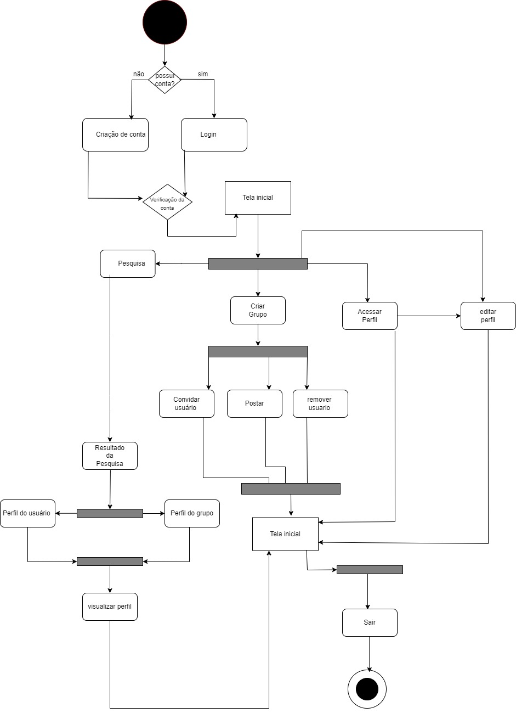
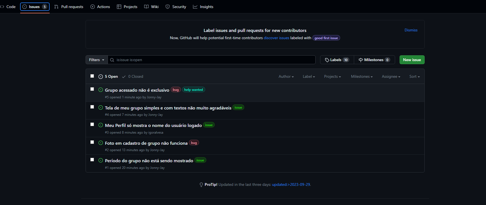
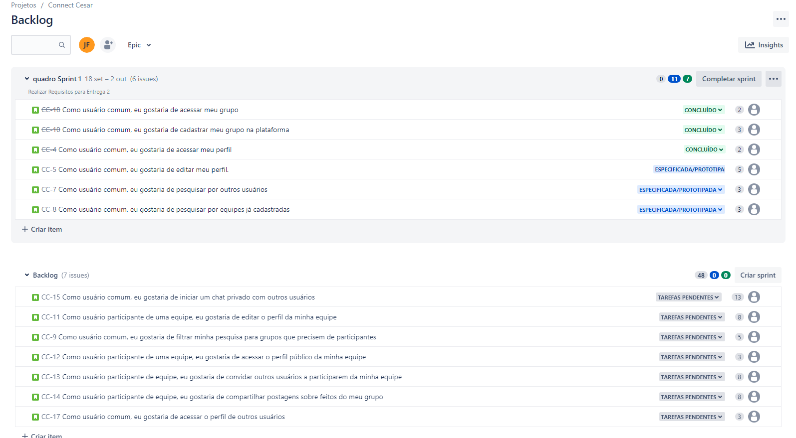
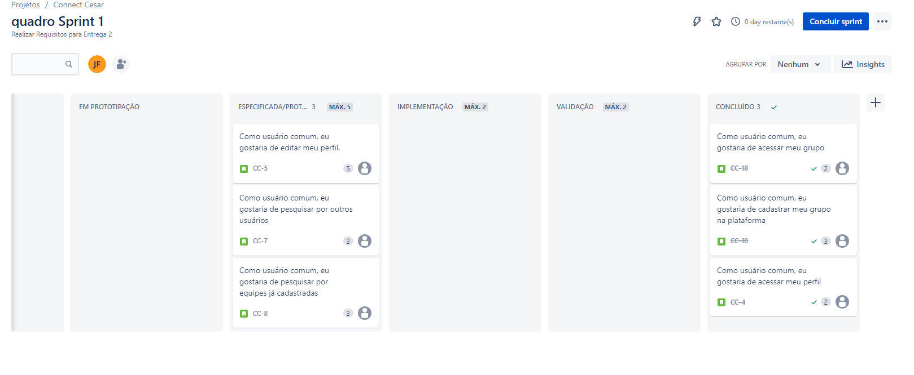

  
<h1 align="center">Connect CESAR </h1>

>Status: 🚧 Em desenvolvimento... 🚧

# Índice
* [Descrição](#descrição)
* [Equipe](#equipe)
* [Links](#links)
* [Entrega 1](#entrega_1)
* [Entrega 2](#entrega_2)

## Descrição
Plataforma criada para a cadeira de Fundamentos de Desenvolvimento de Software com o intuito de reunir os estudantes das graduações da CESAR School na cadeira de Projetos. 

Através do seu uso, os alunos poderão formar grupos mais facilmente, visualizando os perfis das pessoas cadastradas com as mais diversas informações, como tipo de perfil, características, habilidades, interesses, etc.

Dessa forma, com o Connect CESAR, o network entre os estudantes será impulsionado, levando os grupos a serem montados de uma maneira rápida, prática e eficiente.

## Links
* <a href="https://www.figma.com/file/UyXPbIk4jsHQoTUXDffQGl/Connect-CESAR?type=design&node-id=516%3A91&mode=design&t=HFYYJSwDUDUiuZqm-1" target="_blank" rel="noopener noreferrer">Figma</a>
* <a href="https://connectcesar.atlassian.net/jira/software/projects/CC/boards/1/" target="_blank" rel="noopener noreferrer">Jira</a>

## Entrega_1
<a href="https://drive.google.com/file/d/1SBElWr8Og6MIkIEGrB-vvPUCRnvjlBSs/view?usp=sharing" target="_blank" rel="noopener noreferrer">Screencast</a>
<h3 align="left">Print do Backlog</h3>

  

<h3 align="left">Print do Quadro Sprint 1</h3>

  

## Entrega_2
<h3>Nosso Site: https://connectcesar.azurewebsites.net</h3>
 
<h3 align="left">Diagrama de atividades</h3>

  

  <h3 align="left">Issue/bug tracker</h3>

  

  ### Instruções de Uso
  https://docs.google.com/document/d/1u0d6eJo4CssFMLD0yrG8uC1CYGwSa5j2c7FekSvYrls/edit

   ### Relato Programação em Par
  https://docs.google.com/document/d/1HMgFS6grvc7ghHJqa_3I_6-wmORn5KY4ejPAV3zUSWQ/edit

<h3 align="left">Print do Backlog</h3>

  

<h3 align="left">Print do Quadro Sprint 1</h3>

  

## Equipe
* Arthur Pinheiro - apb@cesar.school
* Emanuel Eduardo de Sousa - eess2@cesar.school
* Gabriel Caetano - gcgpf@cesar.school
* Igor Alves - iaa@cesar.school
* João Vítor Meneses - jvmf@cesar.school
* Lucas Kabbaz - lbk@cesar.school
